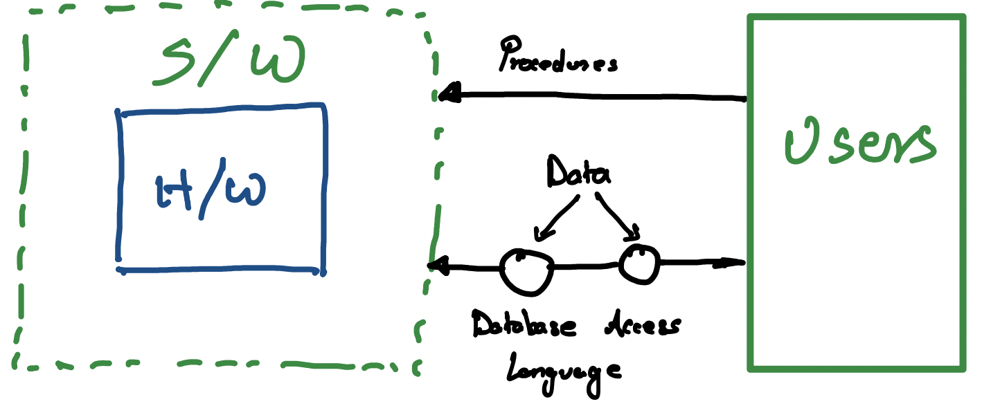
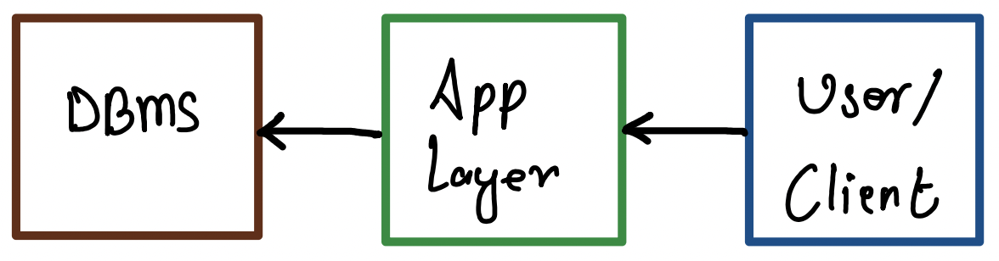
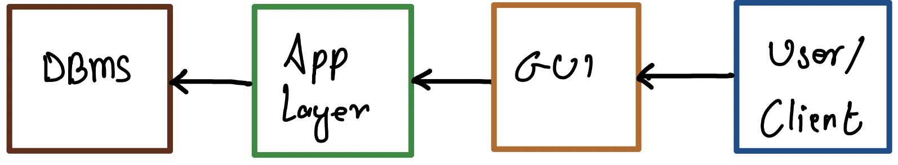
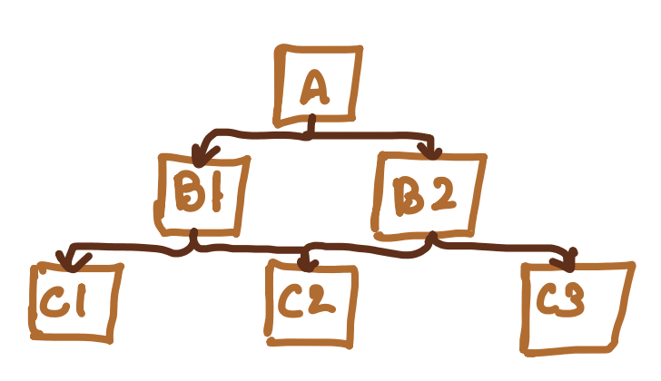
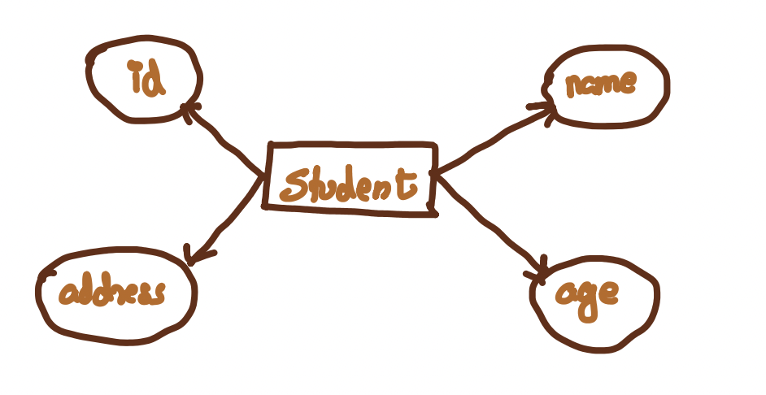
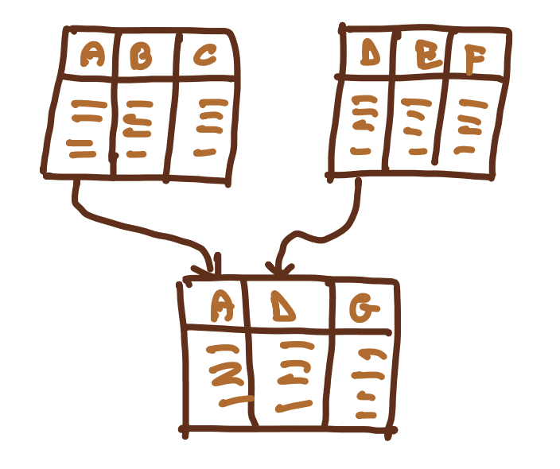

# 1. DBMS

## Definitions

- **Data:** Data is row, unprocessed facts and figures that stored and used for analysis.
- **Database:** Database is a collection of related data organized in a way that data can be easily accessed, managed and updated.
- **DBMS:** DBMS is a software that allows creation, definition and manipulation of database, allowing users to store, process and analyze data easily.

## Characteristics of DBMS

- Data stored in tables
- Reduced redundancy
- Data consistency
- Support multiple users and concurrent access
- Query Language
- Security
- Transactions

## Advantages of DBMS

- Segregation of application program
- Minimal data redundancy
- Easy retrieval of data using QL
- Reduced development time & maintenance need
- Cloud Data Centers infinite data store
- Seamless integration to application programming languages

## Disadvantages of DBMS

- Complex
- MySQL free, Others → expensive
- Large in size

## DBMS Components

> 
>
> _Insert your diagram from Page 2 showing H/W, S/W, Data, Database Access Language, and Users._

- **Procedures:** instructions to use a DBMS - setup, login, logout, backup, generate report
- **Database Access Language:** language designed to write commands to CRUD in database
- **Users:** Database Admins, Software Developer, End User

## DBMS Architecture

- **Types:** Centralized, Decentralized, Hierarchical
- **1-tier DBMS:** Database is directly available for user to access and store data. This is rare, local and not very useful.
- **2-tier DBMS:** Includes an Application layer between user and DBMS. An application interface known as ODBC (Open Database Connectivity) provides an API that allow client-side program to call DBMS. Most DBMS vendors provide ODBC. IT is secure and not exposed to end-user. Security can be improved through authentications at Application layer.

> 
>
> _Insert your 2-tier diagram from Page 2 (DBMS, App Layer, User/Client)._

- **3-tier DBMS:** Includes an additional Presentation / GUI layer between User/Client and Application layer. For end user, GUI is DB system, has no idea about App layer or DBMS. PHPMyAdmin is GUI of MySQL.

> 
>
> _Insert your 3-tier diagram from Page 2 (DBMS, App Layer, GUI, User/Client)._

## Database Models

A database model defines the logical and structure of a database. It defines how data will be stored, accessed, and updated in a database management system. Choose database model as per application requirement. Database model sets rule, relationships, constraints, to define how data is stored. It creates blue print of the database.

### Types of Database Models

#### 1. Hierarchical Model

It organizes data into a tree-like structure, with a single root to which all other data is linked. Starts from root, expands like a tree by adding child nodes to parent nodes. Child node has a single parent node. IBM's Information Management System (IMS) is based on this model. Less Flexible, doesn't support many-to-many relationships.

> 
>
> _Insert your hierarchical model diagram from Page 3 (College, Department, Course, etc.)._

#### 2. Network Model

It's an extension of hierarchical model. Data is organized more like a graph, and allowed to have more than one parent node. Data is more related as there are more relationships and thus faster and easier access. It has many-to-many relationships. Integrated Data Store (IDS) is based on this. Implementation is complex, difficult to maintain & modify.

> 
>
> _Insert your network model diagram from Page 3 (A, B1, B2, C1, C2)._

#### 3. Entity-Relationship Model

Here the relationships are created by dividing objects of interest into entities and their characteristics into attributes. E-R models are defined to represent the relationships in pictorial form. It is good to design Database and can represent data structures easily.

> 

> _Insert your E-R model diagram from Page 3 (Student entity)._

#### 4. Relational Model

The data is organized in 2D tables and the relationship is maintained by storing a common field. Basic structure is tables / information is stored in rows of tables. They can be normalized for efficiency and SQL can be used to access. Eg- Oracle, MySQL. It is simple, easy, popular and supports SQL.

> 

> _Insert your relational model diagram from Page 4 (showing tables with A, B, C...)._

#### 5. Object-oriented Model

Data is stored in the form of objects. Behavior is similar to OOP. Mongo DB is object oriented and also a NoSQL database. It is not mature enough as Relational but can easily support complex DS and support features like inheritance, encapsulation, etc.

#### 6. NOSQL Model

It supports an unstructured style of storing data. Data is stored as documents which look more like JSON strings or Key-value based Object representations. It provides flexible schema and features like Indexing, relationships, etc. The support for data querying is limited but it is scalable, has high performance and can handle large volumes. It is well-suited for Big data applications, realtime analytics and Content Management Systems (CMS), etc.

#### 7. Graph Model

It is based on more real-world like relationships. Data is represented using nodes and is related by edges. It handles complex relationships very well. Eg- Neo4j. Well suited in social networks, recommendation systems.

<!-- ## DBMS ER model -->
