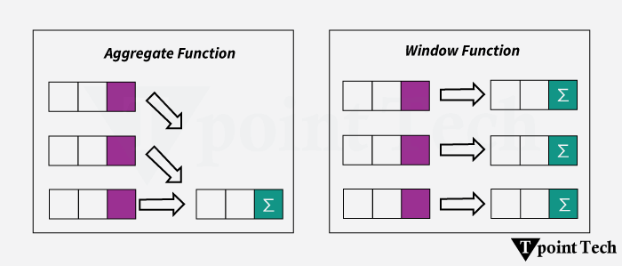

# Advanced SQL - Part 8

## SQL Window Functions

A window function performs a calculation across a set of table rows that are somehow related to the current row. Unlike aggregate functions, use of a window function does not cause rows to be grouped into a single output row - the rows retain their separate identities.

**Example:** An aggregate function is like calculating the average temperature of a city, while a window function is like calculating each day's temperature along with the city's average.



**Syntax:**

```sql
SELECT column1,
WindowFunctionName(column2) OVER (
  PARTITION BY column3
  ORDER BY column4
) AS NewColumn
FROM TableName;
```

- **_WindowFunctionName:_** It is the window function name that will be run over the query.
- **_`OVER`:_** It defines thw window frame (set of rows)
- **_`PARTITION BY`:_** It divides data into group and is _Optional_.

The most practical example of this is a running total:

```sql
SELECT duration_seconds,
       SUM(duration_seconds) OVER (ORDER BY start_time) AS running_total
  FROM tutorial.dc_bikeshare_q1_2012
```

```sql
SELECT start_terminal,
       duration_seconds,
       SUM(duration_seconds) OVER
         (PARTITION BY start_terminal ORDER BY start_time)
         AS running_total
  FROM tutorial.dc_bikeshare_q1_2012
 WHERE start_time < '2012-01-08'
```

The `ORDER` and `PARTITION` define what is referred to as the **"window"**—the ordered subset of data over which calculations are made.

**Note:** You can't use window functions and standard aggregations in the same query. More specifically, you can't include window functions in a GROUP BY clause.

**Question 1:** Write a query modification of the above example query that shows the duration of each ride as a percentage of the total time accrued by riders from each start_terminal

```sql
SELECT start_terminal,
       duration_seconds,
       SUM(duration_seconds) OVER (PARTITION BY start_terminal) AS start_terminal_sum,
       (duration_seconds/SUM(duration_seconds) OVER (PARTITION BY start_terminal))*100 AS pct_of_total_time
  FROM tutorial.dc_bikeshare_q1_2012
 WHERE start_time < '2012-01-08'
```

### `SUM`, `COUNT`, and `AVG`

When using window functions, you can apply the same aggregates that you would under normal circumstances—`SUM`, `COUNT`, and `AVG`. You could also use `MIN` and `MAX`.

**Example:**

```sql
SELECT start_terminal,
       duration_seconds,
       SUM(duration_seconds) OVER
         (PARTITION BY start_terminal ORDER BY start_time)
         AS running_total,
       COUNT(duration_seconds) OVER
         (PARTITION BY start_terminal ORDER BY start_time)
         AS running_count,
       AVG(duration_seconds) OVER
         (PARTITION BY start_terminal ORDER BY start_time)
         AS running_avg
  FROM tutorial.dc_bikeshare_q1_2012
 WHERE start_time < '2012-01-08'
```

**Question 2:** Write a query that shows a running total of the duration of bike rides (similar to the last example), but grouped by `end_terminal`, and with ride duration sorted in descending order.

```sql
SELECT end_terminal,
      duration_seconds,
      SUM(duration_seconds) OVER
        (PARTITION BY end_terminal ORDER BY duration_seconds DESC)
        AS running_total
  FROM tutorial.dc_bikeshare_q1_2012
WHERE start_time < '2012-01-08'
```

### `ROW_NUMBER()`

It displays the number of a given row. It starts are 1 and numbers the rows according to the ORDER BY part of the window statement. `ROW_NUMBER()` does not require you to specify a variable within the parentheses

```sql
SELECT start_terminal,
       start_time,
       duration_seconds,
       ROW_NUMBER() OVER (ORDER BY start_time)
                    AS row_number
  FROM tutorial.dc_bikeshare_q1_2012
 WHERE start_time < '2012-01-08'
```

Using the PARTITION BY clause will allow you to begin counting 1 again in each partition. The following query starts the count over again for each terminal

```sql
SELECT start_terminal,
       start_time,
       duration_seconds,
       ROW_NUMBER() OVER (PARTITION BY start_terminal
                          ORDER BY start_time)
                    AS row_number
  FROM tutorial.dc_bikeshare_q1_2012
 WHERE start_time < '2012-01-08'
```

### `RANK()` and `DENSE_RANK()`

Imagine a situation in which three entries have the same value. Using either command, they will all get the same rank. For the sake of this example, let's say it's "2." Here's how the two commands would evaluate the next results differently:

- `RANK()` would give the identical rows a rank of 2, then skip ranks 3 and 4, so the next result would be 5
- `DENSE_RANK()` would still give all the identical rows a rank of 2, but the following row would be 3—no ranks would be skipped.

**Question 3:** Write a query that shows the 5 longest rides from each starting terminal, ordered by terminal, and longest to shortest rides within each terminal. Limit to rides that occurred before Jan. 8, 2012.

```sql
SELECT * FROM (
  SELECT start_terminal,
       duration_seconds,
       RANK() OVER (PARTITION BY start_terminal ORDER BY duration_seconds DESC)
                    AS rank
  FROM tutorial.dc_bikeshare_q1_2012
 WHERE start_time < '2012-01-08'
) sub
WHERE sub.rank < 6
```

### `NTILE()`

You can use window functions to identify what percentile (or quartile, or any other subdivision) a given row falls into. The syntax is NTILE(_# of buckets_). In this case, ORDER BY determines which column to use to determine the ntile

**Example:**

```sql
SELECT start_terminal,
       duration_seconds,
       NTILE(4) OVER
         (PARTITION BY start_terminal ORDER BY duration_seconds)
          AS quartile,
       NTILE(5) OVER
         (PARTITION BY start_terminal ORDER BY duration_seconds)
         AS quintile,
       NTILE(100) OVER
         (PARTITION BY start_terminal ORDER BY duration_seconds)
         AS percentile
  FROM tutorial.dc_bikeshare_q1_2012
 WHERE start_time < '2012-01-08'
 ORDER BY start_terminal, duration_seconds
```

Looking at the results from the query above, you can see that the percentile column doesn't calculate exactly as you might expect. If you only had two records and you were measuring percentiles, you'd expect one record to define the 1st percentile, and the other record to define the 100th percentile. Using the NTILE function, what you'd actually see is one record in the 1st percentile, and one in the 2nd percentile.

**Question 4** Write a query that shows only the duration of the trip and the percentile into which that duration falls (across the entire dataset—not partitioned by terminal).

```sql
SELECT duration_seconds,
       NTILE(100) OVER
         (ORDER BY duration_seconds)
         AS percentile
  FROM tutorial.dc_bikeshare_q1_2012
 WHERE start_time < '2012-01-08'
 ORDER BY duration_seconds DESC
```

### `LAG()` and `LEAD()`

Sometimes we need to return a value from a different row relative to the current row. For example, we might need to compare rows to preceding or following rows, especially in an ordered dataset. In these cases, `LAG()` and `LEAD()` can be used to create columns that pull values from other rows.

**Examples:**

```sql
SELECT start_terminal,
       duration_seconds,
       duration_seconds -LAG(duration_seconds, 1) OVER
         (PARTITION BY start_terminal ORDER BY duration_seconds)
         AS difference
  FROM tutorial.dc_bikeshare_q1_2012
 WHERE start_time < '2012-01-08'
 ORDER BY start_terminal, duration_seconds
```

The first row of the difference column is null because there is no previous row from which to pull. It can be wrapped it in an outer query to remove nulls.

```sql
SELECT *
  FROM (
    SELECT start_terminal,
           duration_seconds,
           duration_seconds -LAG(duration_seconds, 1) OVER
             (PARTITION BY start_terminal ORDER BY duration_seconds)
             AS difference
      FROM tutorial.dc_bikeshare_q1_2012
     WHERE start_time < '2012-01-08'
     ORDER BY start_terminal, duration_seconds
       ) sub
 WHERE sub.difference IS NOT NULL
```

### Defining a Window Alias

iIf several window functions are to be written in the same query, using the same window, an alias can be created to make things easy. Consider the `NTILE` example from before. It can be rewritten as:

```sql
SELECT start_terminal,
       duration_seconds,
       NTILE(4) OVER ntile_window AS quartile,
       NTILE(5) OVER ntile_window AS quintile,
       NTILE(100) OVER ntile_window AS percentile
  FROM tutorial.dc_bikeshare_q1_2012
 WHERE start_time < '2012-01-08'
WINDOW ntile_window AS
         (PARTITION BY start_terminal ORDER BY duration_seconds)
 ORDER BY start_terminal, duration_seconds
```

**NOTE:** The `WINDOW` clause, if included, should always come after the `WHERE` clause.
