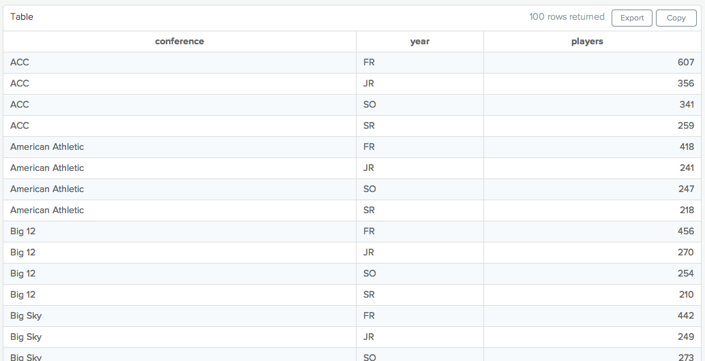
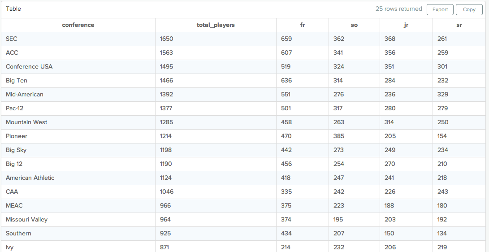
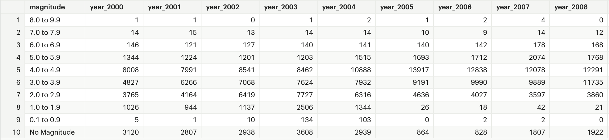
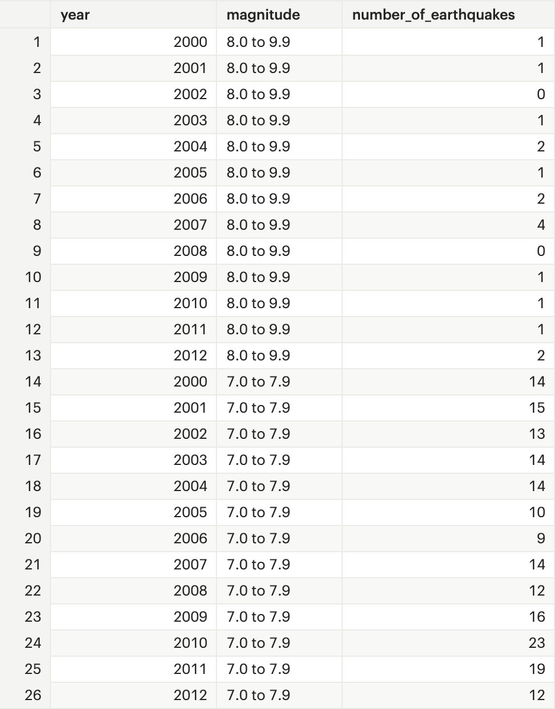

# Advanced SQL - Part 9

## Performance Tuning SQL Queries

### What is SQL Performance Tuning?

It is the process of improving SQL queries to accelerate the servers performance. It's main aim is to reduce amount of time to execute, and reduce amount of resources to process queries.

The way to make queries faster is to reduce the number of calculations that the software must perform. The high-level things that will affect the number of calculations to be made:

- **Table size:** If the query hits one or more tables with millions of rows or more, it could affect performance.
- **Joins:** If the query joins two tables in a way that substantially increases the row count of result set, it will likely be slow.
- **Aggregations:** Combining multiple rows to produce a result requires more computation than simply retrieving them.

### How to Achieve Performance Tuning?

1. **Reducing Table Size**
   Filtering the data to include only the required observations can dramatically improve query speed. For example, if we have a time-series data, limiting to a small window can make the queries run much more quickly.

   ```sql
   SELECT *
   FROM benn.sample_event_table
   WHERE event_date >= '2014-03-01'
   AND event_date <  '2014-04-01'
   ```

   EDA can also be performed on a subset of data, refining the work into final query and then removing the limitation helps in escalating the speed of intermediate steps.

   Thus, using `LIMIT` can be very helpful. However, `LIMIT` does notwork the same way with **aggregate** clauses as with `SELECT`. The aggregation is performed first on the entire table and then the output is limited, after calculating. To fix this, use:

   ```sql
   SELECT COUNT(*)
   FROM (
       SELECT *
       FROM benn.sample_event_table
       LIMIT 100
       ) sub
   ```

   In general, when working with subqueries, you should make sure to limit the amount of data you're working with in the place where it will be executed first. This means putting the LIMIT in the subquery, not the outer query.

2. **Making Joins Less Complicated**
   This is an extension of previous method. Similar to reduce data at the earliest point, it is better to reduce the table sizes before joining them. For example,

   ```sql
   SELECT teams.conference AS conference,
       players.school_name,
       COUNT(1) AS players
   FROM benn.college_football_players players
   JOIN benn.college_football_teams teams
       ON teams.school_name = players.school_name
   GROUP BY 1,2
   ```

   There are 26K+ rows in `benn.college_football_players` and thus that many evaluations need to be made. But pre-aggregation can reduce this evaluation size.

   ```sql
   SELECT teams.conference,
       sub.*
   FROM (
           SELECT players.school_name,
               COUNT(*) AS players
           FROM benn.college_football_players players
           GROUP BY 1
       ) sub
   JOIN benn.college_football_teams teams
   ON teams.school_name = sub.school_name
   ```

   Now, it is just 252 evaluations. So dropping that in a subquery and then joining to it in the outer query will reduce the cost of the join substantially.

3. **`EXPLAIN`**
   `EXPLAIN`can added at the beginning of any (working) query to get a sense of how long it will take. It's not perfectly accurate, but it's a useful tool.

   ```sql
   EXPLAIN
   SELECT *
   FROM benn.sample_event_table
   WHERE event_date >= '2014-03-01'
   AND event_date < '2014-04-01'
   LIMIT 100
   ```

   he output is called the Query Plan, and it shows the order in which your query will be executed.

   

   The entry at the bottom of the list is executed first. So this shows that the `WHERE` clause, which limits the date range, will be executed first. Then, the database will scan 600 rows (this is an approximate number). The cost is listed next to the number of rows, higher numbers mean longer run time. It should be used more as a reference than as an absolute measure. To clarify, this is most useful by running `EXPLAIN` on a query, modify the steps that are expensive, then run `EXPLAIN` again to see if the cost is reduced. Finally, the `LIMIT` clause is executed last and is really cheap to run.

## Pivoting Data in SQL

### Pivoting Rows to Columns

Let's take this data



and make it look like this



```sql
SELECT conference,
       SUM(players) AS total_players,
       SUM(CASE WHEN year = 'FR' THEN players ELSE NULL END) AS fr,
       SUM(CASE WHEN year = 'SO' THEN players ELSE NULL END) AS so,
       SUM(CASE WHEN year = 'JR' THEN players ELSE NULL END) AS jr,
       SUM(CASE WHEN year = 'SR' THEN players ELSE NULL END) AS sr
  FROM (
        SELECT teams.conference AS conference,
               players.year,
               COUNT(1) AS players
          FROM benn.college_football_players players
          JOIN benn.college_football_teams teams
            ON teams.school_name = players.school_name
         GROUP BY 1,2
       ) sub
 GROUP BY 1
 ORDER BY 2 DESC
```

Analyze the above query step by step properly to learn.

### Pivoting Columns to Rows

Let's take this data



and make it look like this



```sql
SELECT years.*,
       earthquakes.magnitude,
       CASE year
         WHEN 2000 THEN year_2000
         WHEN 2001 THEN year_2001
         WHEN 2002 THEN year_2002
         WHEN 2003 THEN year_2003
         WHEN 2004 THEN year_2004
         WHEN 2005 THEN year_2005
         WHEN 2006 THEN year_2006
         WHEN 2007 THEN year_2007
         WHEN 2008 THEN year_2008
         WHEN 2009 THEN year_2009
         WHEN 2010 THEN year_2010
         WHEN 2011 THEN year_2011
         WHEN 2012 THEN year_2012
         ELSE NULL END
         AS number_of_earthquakes
  FROM tutorial.worldwide_earthquakes earthquakes
 CROSS JOIN (
       SELECT year
         FROM (VALUES (2000),(2001),(2002),(2003),(2004),(2005),(2006),
                      (2007),(2008),(2009),(2010),(2011),(2012)) v(year)
       ) years
```

Analyze the above query step by step properly to learn.
