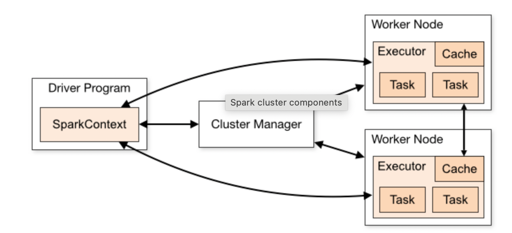

# 1. Introduction

## What is Apache Spark?

Imagine we have a Python script that reads a CSV file and calculates the average sales.

- **Standard Python (Pandas):** The computer's RAM (memory) holds the data, and the CPU calculates the average. If the file is 500GB, our laptop crashes.

- **Apache Spark:** It takes that 500GB file and slices it into smaller chunks. It distributes those chunks across 10, 20, or 100 computers. They all calculate a piece of the average at the same time, and Spark combines the results.

**Key Definition:** Spark is a distributed computing engine. It allows us to write code (in Python, SQL, Scala, or Java) that treats a massive cluster of computers as if it were just one single powerful machine.

### Features

- **In-Memory Processing:** Unlike older tools (like Hadoop MapReduce) that constantly saved data to the hard drive, Spark tries to keep data in RAM (memory). This makes it up to 100x faster.

- **Unified Engine:** It can be used for SQL queries, streaming data, machine learning, and graph processing all in one place.

## Spark Architecture

Spark Architecture depends upon two abstractions

### 1. RDD (Resilient Distributed Dataset)

The RDD is the fundamental building block of Spark, though in modern PySpark, we will only work with DataFrames (which are built on top of RDDs).

- **Dataset:** It is a collection of data elements (like a list in Python).

- **Distributed:** The data is split into partitions and spread across the various Worker Nodes in the cluster.

- **Resilient:** If a partition of data is lost on one worker (e.g., the worker node crashes), Spark knows the original steps needed to recreate that partition from the original source data. This is achieved through the Lineage or history of transformations.

### 2. DAG (Directed Acyclic Graph)

The `DAG` is the blueprint or roadmap that Spark builds during the lazy evaluation phase

- **Directed:** The operations have a specific, one-way flow (A -> B -> C).
- **Acyclic:** There are no loops or backward steps. Once a transformation is done, it's done.
- **Graph:** It's a set of connected transformation steps that lead to the final result.

To understand how Spark works, we have to look at how it manages all those computers working together.

1. **The Driver Program (The Brains)**  
   The Driver is the process that runs the main() function of our application. It is the "command center."

   - **Responsibilities:**

     - It converts the Python code into a workflow (DAG).
     - It breaks that workflow into small Tasks.
     - It collects the final results to show us.

   - **_Note:_** If you run a script in a Jupyter Notebook or PySpark shell, that is the Driver.

2. The Cluster Manager (The Resource Allocator)
   The Driver cannot just grab computers; it has to ask permission. The Cluster Manager controls the physical resources (CPU and RAM) of the entire network.

   - **Responsibilities:**

     - It receives a request from the Driver: "I need 10GB of RAM and 4 CPUs."
     - It checks the network to see who is free and allocates those resources.

   - Examples: YARN (Hadoop), Kubernetes, or Mesos are all types of Cluster Managers.

3. **The Worker Node (The Hardware)**
   These are the actual server machines (computers) in the cluster.

   - **Responsibilities:**
     - They provide the raw hardware (CPU, Memory, Storage) to do the work.
     - They report their status back to the Cluster Manager ("I am healthy/I am busy").

4. **The Executor (The Muscle)**
   This is the most critical concept to grasp. The Worker Node is the computer, but the Executor is the application running inside that computer.

   - **Responsibilities:**

     - The Executor is a process launched on a Worker Node specifically for our application.
     - It runs the Tasks sent by the Driver.
     - It stores data in memory (RAM) or on the disk.

   - **Relationship:** One Worker Node can host multiple Executors (if the computer is powerful enough).

### Workflow

1. **The Driver** looks at the code and creates a plan. It asks the **Cluster Manager** for resources.

2. **The Cluster Manager** launches **Executors** on the available **Worker Nodes**.

3. **The Driver** sends specific Tasks (code + data) directly to the **Executors**.

4. **The Executors** do the math (filtering, aggregating) and send the results back to the **Driver**.

5. **The Driver** compiles the results and displays them.

## Spark Components

1. Spark Core (The Engine)

   - This is the heart of the system. It is the foundation that runs underneath everything else.

   - **What it does:** It handles memory management, fault recovery (if a computer dies), and interacting with storage systems (like HDFS or S3).

   - **Key Concept:** It defines the RDD (Resilient Distributed Dataset), which is the raw data structure Spark uses behind the scenes.

   - We rarely touch this directly anymore. We usually use the higher-level tools below, but Spark Core makes them all possible.

2. Spark SQL (The Bread & Butter)

   - **What it does:** It allows us to work with structured data (like tables) using SQL queries or the DataFrame API (similar to Pandas).

   - **Why it's great:** It is optimized to be much faster than raw Python. It lets us mix SQL queries with Python code seamlessly.

   - **Key Concept:** DataFrames. Just like Pandas DataFrames, but distributed across 100 computers.

3. Spark Streaming (The Real-Time Processor)

   - **What it does:** It processes live data streams (like data coming from a sensor or a website clickstream) in real-time.

   - **How it works:** Instead of processing one row at a time, it breaks the live stream into tiny little batches (e.g., every 1 second) and processes them.

   - **Use Case:** detecting credit card fraud the moment a swipe happens.

4. MLlib (Machine Learning Library)

   - **What it does:** A library of machine learning algorithms designed to run on big clusters.

   - **Why use it?** Standard libraries like Scikit-Learn fail when the dataset is 1 TB. MLlib is designed to chew through massive datasets to train models.

   - **Use Case:** Predicting customer churn based on 5 years of history for 100 million users.

5. GraphX (The Network Analyzer)

   - **What it does:** A specialized engine for processing graphs (not bar charts, but network graphs like social networks).

   - **Use Case:** Calculating "PageRank" for Google or finding the shortest path between two cities in a logistics network.

## Lazy Evaluation

**Lazy Evaluation** is the secret to Spark's speed and efficiency. Spark doesn't execute any work immediately when we write a transformation, it waits until the very last moment.

**Transformations:** These are operations like `filter()`, `map()`, or `select()`. When we write them, Spark just records the instruction (or adds it to the DAG). No data moves.

**Actions:** These are operations like `count()`, `collect()`, or `write()`. These operations force Spark to finally execute all the recorded transformations.

Example:

- Consider that Spark is provided with a set of 4 **Transformations**: `transformationA`, `transformationB`, `transformationC`, `transformationD`.
- Spark receives this information and does not start transforming data as per the provided transformations.
- It stores this information into a **Logical Plan** developed in the form of **`DAG`**.
- This `DAG` optimizes the execution order of transformations using this Logical Plan and stores it until all the transformations keep on coming.
- Once Spark receives an **Action**, that is when it will follow the `DAG` and execute all **Transformations**.

This "laziness" allows Spark to optimize the entire workflow before execution, eliminating unnecessary steps and planning the most efficient process.

When an **Action** is called, the **Driver** uses the `DAG` to figure out the most efficient way to break down the total work into **Jobs**, **Stages**, and **Tasks**.

## Spark Jobs, Stages and Tasks

### Spark Job

A **Job** is created every time an **Action** is called. It represents the complete set of work needed to compute that action, traversing the entire `DAG`.

`One Action = One Job.`

### Spark Stages

A **Job** is broken down into one or more **Stages**. The division between Stages is determined by the required data movement across the cluster, specifically an operation called a **Shuffle**.

- **Narrow Transformation (No Shuffle)**: Operations like `map()` or `filter()` where one partition of input data results in one partition of output data. These can happen in the same Stage.

- **Wide Transformation (Shuffle Required)**: Operations like `groupByKey()` or `join()` that require data from different partitions to be exchanged between **Worker Nodes**. This is expensive and forces a new Stage.

- Stages are separated by Shuffle boundaries.

### Spark Tasks

A Task is the smallest unit of work sent to an Executor.

- The **Driver** breaks each Stage into a set of **Tasks**.

- Typically, there is one **Task** created for every data **Partition**.

- An **Executor** runs one or more Tasks concurrently, applying the necessary transformations defined by that Stage on its local chunk of data.

- The Task is the actual execution code that runs on the **Worker Node**.
